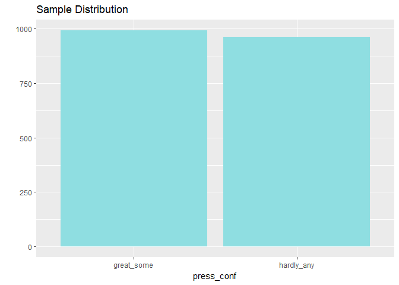
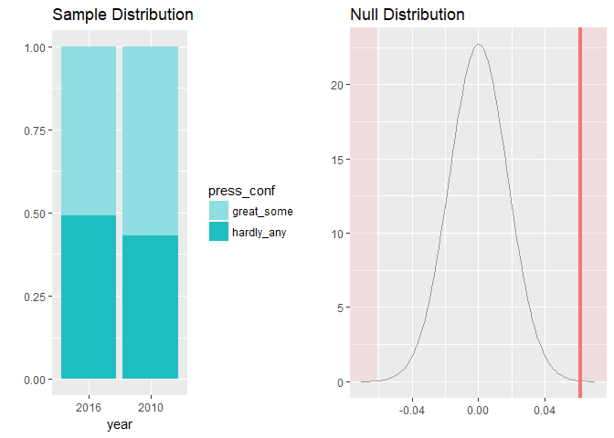
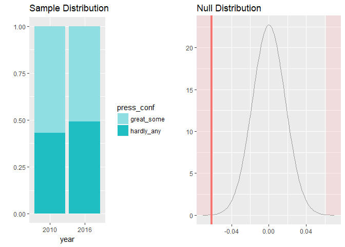

Statistical Inference with General Social Survey (GSS) Data
================

-   [Introduction](#introduction)
-   [Load packages](#load-packages)
-   [Load data](#load-data)
-   [Research Question 1](#research-question-1)
    -   [EDA](#eda)
    -   [Inference](#inference)
        -   [Confidence Intervals](#confidence-intervals)
        -   [Hypothesis Test- Difference in Proportions](#hypothesis-test--difference-in-proportions)

Introduction
------------

This is a project where I will be using GSS data as a playground for statistical inference. I'll use a research question to motivate the different inference methods that I cover. This will be followed by some EDA to explore the data and gain some insight using visualizations. Finally, I will use a Consider this a work in progress as I plan on adding examples of different statistical inference techniques as time allows.

The General Social Survey ([GSS](http://gss.norc.org/)) is a federally funded social survey that began in 1972. With a few exceptions, the survey was initally done on a yearly basis until 1994, after which it was conducted every other year. The GSS is second only to the US census as a source of data for the social sciences. Respondents are selected randomly using an area probability design and the surveys are conducted as a face-to-face interview.

Though there are some [weighting](http://gss.norc.org/documents/codebook/GSS_Codebook_AppendixA.pdf) techniques to be aware of, the data can be used for inference and establishing correlation between variables. As this is is only observational data, conclusions regarding causation can not be made. Some potential biases include potential respondents who are not home at the time the survey was to be conducted and potential respondents that refuse to participate.

Load packages
-------------

``` r
library(ggplot2)
library(dplyr)
library(statsr)
library(tidyverse)
library(janitor)
library(infer)
library(foreign)
```

Load data
---------

The data was obtained by creating an 'extract' from the GSS website. Essentially, the site allows one to choose features a la carte from the &gt;5000 features available and then to download the combined feature set in a file type of your choosing. Alternatively, the entire data set can be downloade in one shot.

``` r
# load data
gss_dat <- read.csv("gss_data.csv", na.strings = c("Not applicable", " ", "Dk na"), 
    skip = 1, header = TRUE)
```

We can take a look at the first couple of rows of the data and scroll through the features.

``` r
head(gss_dat)
```

<table>
<thead>
<tr>
<th style="text-align:left;">
year
</th>
<th style="text-align:left;">
id\_
</th>
<th style="text-align:left;">
marital
</th>
<th style="text-align:left;">
spwrksta
</th>
<th style="text-align:left;">
spwrkslf
</th>
<th style="text-align:left;">
childs
</th>
<th style="text-align:left;">
age
</th>
<th style="text-align:left;">
paeduc
</th>
<th style="text-align:left;">
maeduc
</th>
<th style="text-align:left;">
speduc
</th>
<th style="text-align:left;">
degree
</th>
<th style="text-align:left;">
padeg
</th>
<th style="text-align:left;">
madeg
</th>
<th style="text-align:left;">
spdeg
</th>
<th style="text-align:left;">
sex
</th>
<th style="text-align:left;">
race
</th>
<th style="text-align:left;">
income
</th>
<th style="text-align:left;">
partyid
</th>
<th style="text-align:left;">
vote72
</th>
<th style="text-align:left;">
pres72
</th>
<th style="text-align:left;">
vote76
</th>
<th style="text-align:left;">
pres76
</th>
<th style="text-align:left;">
vote80
</th>
<th style="text-align:left;">
pres80
</th>
<th style="text-align:left;">
vote84
</th>
<th style="text-align:left;">
pres84
</th>
<th style="text-align:left;">
vote88
</th>
<th style="text-align:left;">
pres88
</th>
<th style="text-align:left;">
vote92
</th>
<th style="text-align:left;">
pres92
</th>
<th style="text-align:left;">
vote96
</th>
<th style="text-align:left;">
pres96
</th>
<th style="text-align:left;">
vote00
</th>
<th style="text-align:left;">
pres00
</th>
<th style="text-align:left;">
vote04
</th>
<th style="text-align:left;">
pres04
</th>
<th style="text-align:left;">
vote08
</th>
<th style="text-align:left;">
pres08
</th>
<th style="text-align:left;">
vote12
</th>
<th style="text-align:left;">
pres12
</th>
<th style="text-align:left;">
polviews
</th>
<th style="text-align:left;">
natspac
</th>
<th style="text-align:left;">
natenvir
</th>
<th style="text-align:left;">
natheal
</th>
<th style="text-align:left;">
natcity
</th>
<th style="text-align:left;">
natcrime
</th>
<th style="text-align:left;">
natdrug
</th>
<th style="text-align:left;">
nateduc
</th>
<th style="text-align:left;">
natrace
</th>
<th style="text-align:left;">
natarms
</th>
<th style="text-align:left;">
nataid
</th>
<th style="text-align:left;">
natfare
</th>
<th style="text-align:left;">
natroad
</th>
<th style="text-align:left;">
natsoc
</th>
<th style="text-align:left;">
natmass
</th>
<th style="text-align:left;">
natpark
</th>
<th style="text-align:left;">
natsci
</th>
<th style="text-align:left;">
eqwlth
</th>
<th style="text-align:left;">
tax
</th>
<th style="text-align:left;">
gunlaw
</th>
<th style="text-align:left;">
denom
</th>
<th style="text-align:left;">
attend
</th>
<th style="text-align:left;">
reliten
</th>
<th style="text-align:left;">
relig16
</th>
<th style="text-align:left;">
prayer
</th>
<th style="text-align:left;">
racdin
</th>
<th style="text-align:left;">
raclive
</th>
<th style="text-align:left;">
health
</th>
<th style="text-align:left;">
confinan
</th>
<th style="text-align:left;">
conbus
</th>
<th style="text-align:left;">
conclerg
</th>
<th style="text-align:left;">
coneduc
</th>
<th style="text-align:left;">
confed
</th>
<th style="text-align:left;">
conlabor
</th>
<th style="text-align:left;">
conpress
</th>
<th style="text-align:left;">
conmedic
</th>
<th style="text-align:left;">
contv
</th>
<th style="text-align:left;">
conjudge
</th>
<th style="text-align:left;">
consci
</th>
<th style="text-align:left;">
conlegis
</th>
<th style="text-align:left;">
conarmy
</th>
<th style="text-align:left;">
jobfind
</th>
<th style="text-align:left;">
unemp
</th>
<th style="text-align:left;">
abdefect
</th>
<th style="text-align:left;">
abnomore
</th>
<th style="text-align:left;">
abhlth
</th>
<th style="text-align:left;">
abpoor
</th>
<th style="text-align:left;">
abrape
</th>
<th style="text-align:left;">
absingle
</th>
<th style="text-align:left;">
abany
</th>
<th style="text-align:left;">
sexeduc
</th>
<th style="text-align:left;">
letdie1
</th>
<th style="text-align:left;">
suicide1
</th>
<th style="text-align:left;">
owngun
</th>
<th style="text-align:left;">
news
</th>
<th style="text-align:left;">
tvhours
</th>
<th style="text-align:left;">
helppoor
</th>
<th style="text-align:left;">
helpnot
</th>
<th style="text-align:left;">
helpsick
</th>
<th style="text-align:left;">
newsfrom
</th>
<th style="text-align:left;">
scifrom
</th>
<th style="text-align:left;">
advfront
</th>
<th style="text-align:left;">
vetyears
</th>
<th style="text-align:left;">
dwelown
</th>
<th style="text-align:left;">
hhrace
</th>
<th style="text-align:left;">
ballot
</th>
</tr>
</thead>
<tbody>
<tr>
<td style="text-align:left;">
1972
</td>
<td style="text-align:left;">
1
</td>
<td style="text-align:left;">
Never married
</td>
<td style="text-align:left;">
NA
</td>
<td style="text-align:left;">
NA
</td>
<td style="text-align:left;">
0
</td>
<td style="text-align:left;">
23
</td>
<td style="text-align:left;">
10
</td>
<td style="text-align:left;">
NA
</td>
<td style="text-align:left;">
NA
</td>
<td style="text-align:left;">
Bachelor
</td>
<td style="text-align:left;">
Lt high school
</td>
<td style="text-align:left;">
NA
</td>
<td style="text-align:left;">
NA
</td>
<td style="text-align:left;">
Female
</td>
<td style="text-align:left;">
White
</td>
<td style="text-align:left;">
NA
</td>
<td style="text-align:left;">
Ind,near dem
</td>
<td style="text-align:left;">
NA
</td>
<td style="text-align:left;">
NA
</td>
<td style="text-align:left;">
NA
</td>
<td style="text-align:left;">
NA
</td>
<td style="text-align:left;">
NA
</td>
<td style="text-align:left;">
NA
</td>
<td style="text-align:left;">
NA
</td>
<td style="text-align:left;">
NA
</td>
<td style="text-align:left;">
NA
</td>
<td style="text-align:left;">
NA
</td>
<td style="text-align:left;">
NA
</td>
<td style="text-align:left;">
NA
</td>
<td style="text-align:left;">
NA
</td>
<td style="text-align:left;">
NA
</td>
<td style="text-align:left;">
NA
</td>
<td style="text-align:left;">
NA
</td>
<td style="text-align:left;">
NA
</td>
<td style="text-align:left;">
NA
</td>
<td style="text-align:left;">
NA
</td>
<td style="text-align:left;">
NA
</td>
<td style="text-align:left;">
NA
</td>
<td style="text-align:left;">
NA
</td>
<td style="text-align:left;">
NA
</td>
<td style="text-align:left;">
NA
</td>
<td style="text-align:left;">
NA
</td>
<td style="text-align:left;">
NA
</td>
<td style="text-align:left;">
NA
</td>
<td style="text-align:left;">
NA
</td>
<td style="text-align:left;">
NA
</td>
<td style="text-align:left;">
NA
</td>
<td style="text-align:left;">
NA
</td>
<td style="text-align:left;">
NA
</td>
<td style="text-align:left;">
NA
</td>
<td style="text-align:left;">
NA
</td>
<td style="text-align:left;">
NA
</td>
<td style="text-align:left;">
NA
</td>
<td style="text-align:left;">
NA
</td>
<td style="text-align:left;">
NA
</td>
<td style="text-align:left;">
NA
</td>
<td style="text-align:left;">
NA
</td>
<td style="text-align:left;">
NA
</td>
<td style="text-align:left;">
Favor
</td>
<td style="text-align:left;">
NA
</td>
<td style="text-align:left;">
Once a year
</td>
<td style="text-align:left;">
NA
</td>
<td style="text-align:left;">
NA
</td>
<td style="text-align:left;">
NA
</td>
<td style="text-align:left;">
Not object
</td>
<td style="text-align:left;">
Yes
</td>
<td style="text-align:left;">
Good
</td>
<td style="text-align:left;">
NA
</td>
<td style="text-align:left;">
NA
</td>
<td style="text-align:left;">
NA
</td>
<td style="text-align:left;">
NA
</td>
<td style="text-align:left;">
NA
</td>
<td style="text-align:left;">
NA
</td>
<td style="text-align:left;">
NA
</td>
<td style="text-align:left;">
NA
</td>
<td style="text-align:left;">
NA
</td>
<td style="text-align:left;">
NA
</td>
<td style="text-align:left;">
NA
</td>
<td style="text-align:left;">
NA
</td>
<td style="text-align:left;">
NA
</td>
<td style="text-align:left;">
NA
</td>
<td style="text-align:left;">
NA
</td>
<td style="text-align:left;">
Yes
</td>
<td style="text-align:left;">
Yes
</td>
<td style="text-align:left;">
Yes
</td>
<td style="text-align:left;">
Yes
</td>
<td style="text-align:left;">
Yes
</td>
<td style="text-align:left;">
Yes
</td>
<td style="text-align:left;">
NA
</td>
<td style="text-align:left;">
NA
</td>
<td style="text-align:left;">
NA
</td>
<td style="text-align:left;">
NA
</td>
<td style="text-align:left;">
NA
</td>
<td style="text-align:left;">
Everyday
</td>
<td style="text-align:left;">
NA
</td>
<td style="text-align:left;">
NA
</td>
<td style="text-align:left;">
NA
</td>
<td style="text-align:left;">
NA
</td>
<td style="text-align:left;">
NA
</td>
<td style="text-align:left;">
NA
</td>
<td style="text-align:left;">
NA
</td>
<td style="text-align:left;">
NA
</td>
<td style="text-align:left;">
NA
</td>
<td style="text-align:left;">
NA
</td>
<td style="text-align:left;">
NA
</td>
</tr>
<tr>
<td style="text-align:left;">
1972
</td>
<td style="text-align:left;">
2
</td>
<td style="text-align:left;">
Married
</td>
<td style="text-align:left;">
Keeping house
</td>
<td style="text-align:left;">
NA
</td>
<td style="text-align:left;">
5
</td>
<td style="text-align:left;">
70
</td>
<td style="text-align:left;">
8
</td>
<td style="text-align:left;">
8
</td>
<td style="text-align:left;">
12
</td>
<td style="text-align:left;">
Lt high school
</td>
<td style="text-align:left;">
Lt high school
</td>
<td style="text-align:left;">
Lt high school
</td>
<td style="text-align:left;">
High school
</td>
<td style="text-align:left;">
Male
</td>
<td style="text-align:left;">
White
</td>
<td style="text-align:left;">
NA
</td>
<td style="text-align:left;">
Not str democrat
</td>
<td style="text-align:left;">
NA
</td>
<td style="text-align:left;">
NA
</td>
<td style="text-align:left;">
NA
</td>
<td style="text-align:left;">
NA
</td>
<td style="text-align:left;">
NA
</td>
<td style="text-align:left;">
NA
</td>
<td style="text-align:left;">
NA
</td>
<td style="text-align:left;">
NA
</td>
<td style="text-align:left;">
NA
</td>
<td style="text-align:left;">
NA
</td>
<td style="text-align:left;">
NA
</td>
<td style="text-align:left;">
NA
</td>
<td style="text-align:left;">
NA
</td>
<td style="text-align:left;">
NA
</td>
<td style="text-align:left;">
NA
</td>
<td style="text-align:left;">
NA
</td>
<td style="text-align:left;">
NA
</td>
<td style="text-align:left;">
NA
</td>
<td style="text-align:left;">
NA
</td>
<td style="text-align:left;">
NA
</td>
<td style="text-align:left;">
NA
</td>
<td style="text-align:left;">
NA
</td>
<td style="text-align:left;">
NA
</td>
<td style="text-align:left;">
NA
</td>
<td style="text-align:left;">
NA
</td>
<td style="text-align:left;">
NA
</td>
<td style="text-align:left;">
NA
</td>
<td style="text-align:left;">
NA
</td>
<td style="text-align:left;">
NA
</td>
<td style="text-align:left;">
NA
</td>
<td style="text-align:left;">
NA
</td>
<td style="text-align:left;">
NA
</td>
<td style="text-align:left;">
NA
</td>
<td style="text-align:left;">
NA
</td>
<td style="text-align:left;">
NA
</td>
<td style="text-align:left;">
NA
</td>
<td style="text-align:left;">
NA
</td>
<td style="text-align:left;">
NA
</td>
<td style="text-align:left;">
NA
</td>
<td style="text-align:left;">
NA
</td>
<td style="text-align:left;">
NA
</td>
<td style="text-align:left;">
Favor
</td>
<td style="text-align:left;">
NA
</td>
<td style="text-align:left;">
Every week
</td>
<td style="text-align:left;">
NA
</td>
<td style="text-align:left;">
NA
</td>
<td style="text-align:left;">
NA
</td>
<td style="text-align:left;">
Not object
</td>
<td style="text-align:left;">
Yes
</td>
<td style="text-align:left;">
Fair
</td>
<td style="text-align:left;">
NA
</td>
<td style="text-align:left;">
NA
</td>
<td style="text-align:left;">
NA
</td>
<td style="text-align:left;">
NA
</td>
<td style="text-align:left;">
NA
</td>
<td style="text-align:left;">
NA
</td>
<td style="text-align:left;">
NA
</td>
<td style="text-align:left;">
NA
</td>
<td style="text-align:left;">
NA
</td>
<td style="text-align:left;">
NA
</td>
<td style="text-align:left;">
NA
</td>
<td style="text-align:left;">
NA
</td>
<td style="text-align:left;">
NA
</td>
<td style="text-align:left;">
NA
</td>
<td style="text-align:left;">
NA
</td>
<td style="text-align:left;">
Yes
</td>
<td style="text-align:left;">
No
</td>
<td style="text-align:left;">
Yes
</td>
<td style="text-align:left;">
No
</td>
<td style="text-align:left;">
Yes
</td>
<td style="text-align:left;">
Yes
</td>
<td style="text-align:left;">
NA
</td>
<td style="text-align:left;">
NA
</td>
<td style="text-align:left;">
NA
</td>
<td style="text-align:left;">
NA
</td>
<td style="text-align:left;">
NA
</td>
<td style="text-align:left;">
Everyday
</td>
<td style="text-align:left;">
NA
</td>
<td style="text-align:left;">
NA
</td>
<td style="text-align:left;">
NA
</td>
<td style="text-align:left;">
NA
</td>
<td style="text-align:left;">
NA
</td>
<td style="text-align:left;">
NA
</td>
<td style="text-align:left;">
NA
</td>
<td style="text-align:left;">
NA
</td>
<td style="text-align:left;">
NA
</td>
<td style="text-align:left;">
NA
</td>
<td style="text-align:left;">
NA
</td>
</tr>
<tr>
<td style="text-align:left;">
1972
</td>
<td style="text-align:left;">
3
</td>
<td style="text-align:left;">
Married
</td>
<td style="text-align:left;">
Working fulltime
</td>
<td style="text-align:left;">
Someone else
</td>
<td style="text-align:left;">
4
</td>
<td style="text-align:left;">
48
</td>
<td style="text-align:left;">
8
</td>
<td style="text-align:left;">
8
</td>
<td style="text-align:left;">
11
</td>
<td style="text-align:left;">
High school
</td>
<td style="text-align:left;">
Lt high school
</td>
<td style="text-align:left;">
Lt high school
</td>
<td style="text-align:left;">
No answer
</td>
<td style="text-align:left;">
Female
</td>
<td style="text-align:left;">
White
</td>
<td style="text-align:left;">
NA
</td>
<td style="text-align:left;">
Independent
</td>
<td style="text-align:left;">
NA
</td>
<td style="text-align:left;">
NA
</td>
<td style="text-align:left;">
NA
</td>
<td style="text-align:left;">
NA
</td>
<td style="text-align:left;">
NA
</td>
<td style="text-align:left;">
NA
</td>
<td style="text-align:left;">
NA
</td>
<td style="text-align:left;">
NA
</td>
<td style="text-align:left;">
NA
</td>
<td style="text-align:left;">
NA
</td>
<td style="text-align:left;">
NA
</td>
<td style="text-align:left;">
NA
</td>
<td style="text-align:left;">
NA
</td>
<td style="text-align:left;">
NA
</td>
<td style="text-align:left;">
NA
</td>
<td style="text-align:left;">
NA
</td>
<td style="text-align:left;">
NA
</td>
<td style="text-align:left;">
NA
</td>
<td style="text-align:left;">
NA
</td>
<td style="text-align:left;">
NA
</td>
<td style="text-align:left;">
NA
</td>
<td style="text-align:left;">
NA
</td>
<td style="text-align:left;">
NA
</td>
<td style="text-align:left;">
NA
</td>
<td style="text-align:left;">
NA
</td>
<td style="text-align:left;">
NA
</td>
<td style="text-align:left;">
NA
</td>
<td style="text-align:left;">
NA
</td>
<td style="text-align:left;">
NA
</td>
<td style="text-align:left;">
NA
</td>
<td style="text-align:left;">
NA
</td>
<td style="text-align:left;">
NA
</td>
<td style="text-align:left;">
NA
</td>
<td style="text-align:left;">
NA
</td>
<td style="text-align:left;">
NA
</td>
<td style="text-align:left;">
NA
</td>
<td style="text-align:left;">
NA
</td>
<td style="text-align:left;">
NA
</td>
<td style="text-align:left;">
NA
</td>
<td style="text-align:left;">
NA
</td>
<td style="text-align:left;">
NA
</td>
<td style="text-align:left;">
Favor
</td>
<td style="text-align:left;">
Methodist-dk which
</td>
<td style="text-align:left;">
Once a month
</td>
<td style="text-align:left;">
NA
</td>
<td style="text-align:left;">
NA
</td>
<td style="text-align:left;">
NA
</td>
<td style="text-align:left;">
Not object
</td>
<td style="text-align:left;">
Yes
</td>
<td style="text-align:left;">
Excellent
</td>
<td style="text-align:left;">
NA
</td>
<td style="text-align:left;">
NA
</td>
<td style="text-align:left;">
NA
</td>
<td style="text-align:left;">
NA
</td>
<td style="text-align:left;">
NA
</td>
<td style="text-align:left;">
NA
</td>
<td style="text-align:left;">
NA
</td>
<td style="text-align:left;">
NA
</td>
<td style="text-align:left;">
NA
</td>
<td style="text-align:left;">
NA
</td>
<td style="text-align:left;">
NA
</td>
<td style="text-align:left;">
NA
</td>
<td style="text-align:left;">
NA
</td>
<td style="text-align:left;">
NA
</td>
<td style="text-align:left;">
NA
</td>
<td style="text-align:left;">
Yes
</td>
<td style="text-align:left;">
Yes
</td>
<td style="text-align:left;">
Yes
</td>
<td style="text-align:left;">
Yes
</td>
<td style="text-align:left;">
Yes
</td>
<td style="text-align:left;">
Yes
</td>
<td style="text-align:left;">
NA
</td>
<td style="text-align:left;">
NA
</td>
<td style="text-align:left;">
NA
</td>
<td style="text-align:left;">
NA
</td>
<td style="text-align:left;">
NA
</td>
<td style="text-align:left;">
Everyday
</td>
<td style="text-align:left;">
NA
</td>
<td style="text-align:left;">
NA
</td>
<td style="text-align:left;">
NA
</td>
<td style="text-align:left;">
NA
</td>
<td style="text-align:left;">
NA
</td>
<td style="text-align:left;">
NA
</td>
<td style="text-align:left;">
NA
</td>
<td style="text-align:left;">
NA
</td>
<td style="text-align:left;">
NA
</td>
<td style="text-align:left;">
NA
</td>
<td style="text-align:left;">
NA
</td>
</tr>
<tr>
<td style="text-align:left;">
1972
</td>
<td style="text-align:left;">
4
</td>
<td style="text-align:left;">
Married
</td>
<td style="text-align:left;">
Working fulltime
</td>
<td style="text-align:left;">
Someone else
</td>
<td style="text-align:left;">
0
</td>
<td style="text-align:left;">
27
</td>
<td style="text-align:left;">
16
</td>
<td style="text-align:left;">
12
</td>
<td style="text-align:left;">
20
</td>
<td style="text-align:left;">
Bachelor
</td>
<td style="text-align:left;">
Bachelor
</td>
<td style="text-align:left;">
High school
</td>
<td style="text-align:left;">
Graduate
</td>
<td style="text-align:left;">
Female
</td>
<td style="text-align:left;">
White
</td>
<td style="text-align:left;">
NA
</td>
<td style="text-align:left;">
Not str democrat
</td>
<td style="text-align:left;">
NA
</td>
<td style="text-align:left;">
NA
</td>
<td style="text-align:left;">
NA
</td>
<td style="text-align:left;">
NA
</td>
<td style="text-align:left;">
NA
</td>
<td style="text-align:left;">
NA
</td>
<td style="text-align:left;">
NA
</td>
<td style="text-align:left;">
NA
</td>
<td style="text-align:left;">
NA
</td>
<td style="text-align:left;">
NA
</td>
<td style="text-align:left;">
NA
</td>
<td style="text-align:left;">
NA
</td>
<td style="text-align:left;">
NA
</td>
<td style="text-align:left;">
NA
</td>
<td style="text-align:left;">
NA
</td>
<td style="text-align:left;">
NA
</td>
<td style="text-align:left;">
NA
</td>
<td style="text-align:left;">
NA
</td>
<td style="text-align:left;">
NA
</td>
<td style="text-align:left;">
NA
</td>
<td style="text-align:left;">
NA
</td>
<td style="text-align:left;">
NA
</td>
<td style="text-align:left;">
NA
</td>
<td style="text-align:left;">
NA
</td>
<td style="text-align:left;">
NA
</td>
<td style="text-align:left;">
NA
</td>
<td style="text-align:left;">
NA
</td>
<td style="text-align:left;">
NA
</td>
<td style="text-align:left;">
NA
</td>
<td style="text-align:left;">
NA
</td>
<td style="text-align:left;">
NA
</td>
<td style="text-align:left;">
NA
</td>
<td style="text-align:left;">
NA
</td>
<td style="text-align:left;">
NA
</td>
<td style="text-align:left;">
NA
</td>
<td style="text-align:left;">
NA
</td>
<td style="text-align:left;">
NA
</td>
<td style="text-align:left;">
NA
</td>
<td style="text-align:left;">
NA
</td>
<td style="text-align:left;">
NA
</td>
<td style="text-align:left;">
NA
</td>
<td style="text-align:left;">
Favor
</td>
<td style="text-align:left;">
NA
</td>
<td style="text-align:left;">
Never
</td>
<td style="text-align:left;">
NA
</td>
<td style="text-align:left;">
NA
</td>
<td style="text-align:left;">
NA
</td>
<td style="text-align:left;">
Not object
</td>
<td style="text-align:left;">
Yes
</td>
<td style="text-align:left;">
Good
</td>
<td style="text-align:left;">
NA
</td>
<td style="text-align:left;">
NA
</td>
<td style="text-align:left;">
NA
</td>
<td style="text-align:left;">
NA
</td>
<td style="text-align:left;">
NA
</td>
<td style="text-align:left;">
NA
</td>
<td style="text-align:left;">
NA
</td>
<td style="text-align:left;">
NA
</td>
<td style="text-align:left;">
NA
</td>
<td style="text-align:left;">
NA
</td>
<td style="text-align:left;">
NA
</td>
<td style="text-align:left;">
NA
</td>
<td style="text-align:left;">
NA
</td>
<td style="text-align:left;">
NA
</td>
<td style="text-align:left;">
NA
</td>
<td style="text-align:left;">
No
</td>
<td style="text-align:left;">
No
</td>
<td style="text-align:left;">
Yes
</td>
<td style="text-align:left;">
Yes
</td>
<td style="text-align:left;">
Yes
</td>
<td style="text-align:left;">
Yes
</td>
<td style="text-align:left;">
NA
</td>
<td style="text-align:left;">
NA
</td>
<td style="text-align:left;">
NA
</td>
<td style="text-align:left;">
NA
</td>
<td style="text-align:left;">
NA
</td>
<td style="text-align:left;">
Once a week
</td>
<td style="text-align:left;">
NA
</td>
<td style="text-align:left;">
NA
</td>
<td style="text-align:left;">
NA
</td>
<td style="text-align:left;">
NA
</td>
<td style="text-align:left;">
NA
</td>
<td style="text-align:left;">
NA
</td>
<td style="text-align:left;">
NA
</td>
<td style="text-align:left;">
NA
</td>
<td style="text-align:left;">
NA
</td>
<td style="text-align:left;">
NA
</td>
<td style="text-align:left;">
NA
</td>
</tr>
<tr>
<td style="text-align:left;">
1972
</td>
<td style="text-align:left;">
5
</td>
<td style="text-align:left;">
Married
</td>
<td style="text-align:left;">
Temp not working
</td>
<td style="text-align:left;">
Someone else
</td>
<td style="text-align:left;">
2
</td>
<td style="text-align:left;">
61
</td>
<td style="text-align:left;">
8
</td>
<td style="text-align:left;">
8
</td>
<td style="text-align:left;">
12
</td>
<td style="text-align:left;">
High school
</td>
<td style="text-align:left;">
Lt high school
</td>
<td style="text-align:left;">
Lt high school
</td>
<td style="text-align:left;">
High school
</td>
<td style="text-align:left;">
Female
</td>
<td style="text-align:left;">
White
</td>
<td style="text-align:left;">
NA
</td>
<td style="text-align:left;">
Strong democrat
</td>
<td style="text-align:left;">
NA
</td>
<td style="text-align:left;">
NA
</td>
<td style="text-align:left;">
NA
</td>
<td style="text-align:left;">
NA
</td>
<td style="text-align:left;">
NA
</td>
<td style="text-align:left;">
NA
</td>
<td style="text-align:left;">
NA
</td>
<td style="text-align:left;">
NA
</td>
<td style="text-align:left;">
NA
</td>
<td style="text-align:left;">
NA
</td>
<td style="text-align:left;">
NA
</td>
<td style="text-align:left;">
NA
</td>
<td style="text-align:left;">
NA
</td>
<td style="text-align:left;">
NA
</td>
<td style="text-align:left;">
NA
</td>
<td style="text-align:left;">
NA
</td>
<td style="text-align:left;">
NA
</td>
<td style="text-align:left;">
NA
</td>
<td style="text-align:left;">
NA
</td>
<td style="text-align:left;">
NA
</td>
<td style="text-align:left;">
NA
</td>
<td style="text-align:left;">
NA
</td>
<td style="text-align:left;">
NA
</td>
<td style="text-align:left;">
NA
</td>
<td style="text-align:left;">
NA
</td>
<td style="text-align:left;">
NA
</td>
<td style="text-align:left;">
NA
</td>
<td style="text-align:left;">
NA
</td>
<td style="text-align:left;">
NA
</td>
<td style="text-align:left;">
NA
</td>
<td style="text-align:left;">
NA
</td>
<td style="text-align:left;">
NA
</td>
<td style="text-align:left;">
NA
</td>
<td style="text-align:left;">
NA
</td>
<td style="text-align:left;">
NA
</td>
<td style="text-align:left;">
NA
</td>
<td style="text-align:left;">
NA
</td>
<td style="text-align:left;">
NA
</td>
<td style="text-align:left;">
NA
</td>
<td style="text-align:left;">
NA
</td>
<td style="text-align:left;">
NA
</td>
<td style="text-align:left;">
Favor
</td>
<td style="text-align:left;">
Methodist-dk which
</td>
<td style="text-align:left;">
Never
</td>
<td style="text-align:left;">
NA
</td>
<td style="text-align:left;">
NA
</td>
<td style="text-align:left;">
NA
</td>
<td style="text-align:left;">
Not object
</td>
<td style="text-align:left;">
Yes
</td>
<td style="text-align:left;">
Good
</td>
<td style="text-align:left;">
NA
</td>
<td style="text-align:left;">
NA
</td>
<td style="text-align:left;">
NA
</td>
<td style="text-align:left;">
NA
</td>
<td style="text-align:left;">
NA
</td>
<td style="text-align:left;">
NA
</td>
<td style="text-align:left;">
NA
</td>
<td style="text-align:left;">
NA
</td>
<td style="text-align:left;">
NA
</td>
<td style="text-align:left;">
NA
</td>
<td style="text-align:left;">
NA
</td>
<td style="text-align:left;">
NA
</td>
<td style="text-align:left;">
NA
</td>
<td style="text-align:left;">
NA
</td>
<td style="text-align:left;">
NA
</td>
<td style="text-align:left;">
Yes
</td>
<td style="text-align:left;">
Yes
</td>
<td style="text-align:left;">
Yes
</td>
<td style="text-align:left;">
Yes
</td>
<td style="text-align:left;">
Yes
</td>
<td style="text-align:left;">
Yes
</td>
<td style="text-align:left;">
NA
</td>
<td style="text-align:left;">
NA
</td>
<td style="text-align:left;">
NA
</td>
<td style="text-align:left;">
NA
</td>
<td style="text-align:left;">
NA
</td>
<td style="text-align:left;">
Everyday
</td>
<td style="text-align:left;">
NA
</td>
<td style="text-align:left;">
NA
</td>
<td style="text-align:left;">
NA
</td>
<td style="text-align:left;">
NA
</td>
<td style="text-align:left;">
NA
</td>
<td style="text-align:left;">
NA
</td>
<td style="text-align:left;">
NA
</td>
<td style="text-align:left;">
NA
</td>
<td style="text-align:left;">
NA
</td>
<td style="text-align:left;">
NA
</td>
<td style="text-align:left;">
NA
</td>
</tr>
<tr>
<td style="text-align:left;">
1972
</td>
<td style="text-align:left;">
6
</td>
<td style="text-align:left;">
Never married
</td>
<td style="text-align:left;">
NA
</td>
<td style="text-align:left;">
NA
</td>
<td style="text-align:left;">
0
</td>
<td style="text-align:left;">
26
</td>
<td style="text-align:left;">
18
</td>
<td style="text-align:left;">
19
</td>
<td style="text-align:left;">
NA
</td>
<td style="text-align:left;">
High school
</td>
<td style="text-align:left;">
Bachelor
</td>
<td style="text-align:left;">
Graduate
</td>
<td style="text-align:left;">
NA
</td>
<td style="text-align:left;">
Male
</td>
<td style="text-align:left;">
White
</td>
<td style="text-align:left;">
NA
</td>
<td style="text-align:left;">
Ind,near dem
</td>
<td style="text-align:left;">
NA
</td>
<td style="text-align:left;">
NA
</td>
<td style="text-align:left;">
NA
</td>
<td style="text-align:left;">
NA
</td>
<td style="text-align:left;">
NA
</td>
<td style="text-align:left;">
NA
</td>
<td style="text-align:left;">
NA
</td>
<td style="text-align:left;">
NA
</td>
<td style="text-align:left;">
NA
</td>
<td style="text-align:left;">
NA
</td>
<td style="text-align:left;">
NA
</td>
<td style="text-align:left;">
NA
</td>
<td style="text-align:left;">
NA
</td>
<td style="text-align:left;">
NA
</td>
<td style="text-align:left;">
NA
</td>
<td style="text-align:left;">
NA
</td>
<td style="text-align:left;">
NA
</td>
<td style="text-align:left;">
NA
</td>
<td style="text-align:left;">
NA
</td>
<td style="text-align:left;">
NA
</td>
<td style="text-align:left;">
NA
</td>
<td style="text-align:left;">
NA
</td>
<td style="text-align:left;">
NA
</td>
<td style="text-align:left;">
NA
</td>
<td style="text-align:left;">
NA
</td>
<td style="text-align:left;">
NA
</td>
<td style="text-align:left;">
NA
</td>
<td style="text-align:left;">
NA
</td>
<td style="text-align:left;">
NA
</td>
<td style="text-align:left;">
NA
</td>
<td style="text-align:left;">
NA
</td>
<td style="text-align:left;">
NA
</td>
<td style="text-align:left;">
NA
</td>
<td style="text-align:left;">
NA
</td>
<td style="text-align:left;">
NA
</td>
<td style="text-align:left;">
NA
</td>
<td style="text-align:left;">
NA
</td>
<td style="text-align:left;">
NA
</td>
<td style="text-align:left;">
NA
</td>
<td style="text-align:left;">
NA
</td>
<td style="text-align:left;">
NA
</td>
<td style="text-align:left;">
Oppose
</td>
<td style="text-align:left;">
Episcopal
</td>
<td style="text-align:left;">
Once a year
</td>
<td style="text-align:left;">
NA
</td>
<td style="text-align:left;">
NA
</td>
<td style="text-align:left;">
NA
</td>
<td style="text-align:left;">
Mildly object
</td>
<td style="text-align:left;">
Yes
</td>
<td style="text-align:left;">
Good
</td>
<td style="text-align:left;">
NA
</td>
<td style="text-align:left;">
NA
</td>
<td style="text-align:left;">
NA
</td>
<td style="text-align:left;">
NA
</td>
<td style="text-align:left;">
NA
</td>
<td style="text-align:left;">
NA
</td>
<td style="text-align:left;">
NA
</td>
<td style="text-align:left;">
NA
</td>
<td style="text-align:left;">
NA
</td>
<td style="text-align:left;">
NA
</td>
<td style="text-align:left;">
NA
</td>
<td style="text-align:left;">
NA
</td>
<td style="text-align:left;">
NA
</td>
<td style="text-align:left;">
NA
</td>
<td style="text-align:left;">
NA
</td>
<td style="text-align:left;">
Yes
</td>
<td style="text-align:left;">
Yes
</td>
<td style="text-align:left;">
Yes
</td>
<td style="text-align:left;">
Yes
</td>
<td style="text-align:left;">
Yes
</td>
<td style="text-align:left;">
Yes
</td>
<td style="text-align:left;">
NA
</td>
<td style="text-align:left;">
NA
</td>
<td style="text-align:left;">
NA
</td>
<td style="text-align:left;">
NA
</td>
<td style="text-align:left;">
NA
</td>
<td style="text-align:left;">
Everyday
</td>
<td style="text-align:left;">
NA
</td>
<td style="text-align:left;">
NA
</td>
<td style="text-align:left;">
NA
</td>
<td style="text-align:left;">
NA
</td>
<td style="text-align:left;">
NA
</td>
<td style="text-align:left;">
NA
</td>
<td style="text-align:left;">
NA
</td>
<td style="text-align:left;">
NA
</td>
<td style="text-align:left;">
NA
</td>
<td style="text-align:left;">
NA
</td>
<td style="text-align:left;">
NA
</td>
</tr>
</tbody>
</table>

Research Question 1
-------------------

*Is the proportion of people who have 'Hardly Any' confidence in the press different in 2016 than it was in 2010?*

We'll first calculate the proportion of those with 'Hardly any' confidence across the two years in question. This will tell us the differnce in proportions in our sample data. To make an infernce about the greater population of interest, we'll turn to a hypothesis test. The hypothesis test is set up as follows:

H0(null): p\_hardly\_any(2016) = p\_hardly\_any(2010)

HA(alternative): p\_hardly\_any(2016) != p\_hardly\_any(2010)

The null hypothesis states that there is difference in the proportion in the years 2010 and 2016. The alternative hypothesis is that there is a difference in the proportions.

### EDA

We'll first subset our data to select years 2010 and 2016.

``` r
# filter for years of interest and create press_conf feature
gss_press <- gss_dat %>% filter(year == 2010 | year == 2016) %>% mutate(press_conf = ifelse(conpress == 
    "Hardly any", "hardly_any", "great_some")) %>% select(year, press_conf) %>% 
    droplevels() %>% na.omit

# remove unused levels in press_conf feature
gss_press$press_conf <- factor(gss_press$press_conf)
```

We'll then create a table to compare the total counts across years and the factor levels for the press\_conf feature.

``` r
# create table of counts for press_conf by years
tabyl(gss_press, year, press_conf) %>% adorn_totals(c("row", "col"))
```

<table>
<thead>
<tr>
<th style="text-align:left;">
year
</th>
<th style="text-align:right;">
great\_some
</th>
<th style="text-align:right;">
hardly\_any
</th>
<th style="text-align:right;">
Total
</th>
</tr>
</thead>
<tbody>
<tr>
<td style="text-align:left;">
2010
</td>
<td style="text-align:right;">
783
</td>
<td style="text-align:right;">
594
</td>
<td style="text-align:right;">
1377
</td>
</tr>
<tr>
<td style="text-align:left;">
2016
</td>
<td style="text-align:right;">
993
</td>
<td style="text-align:right;">
963
</td>
<td style="text-align:right;">
1956
</td>
</tr>
<tr>
<td style="text-align:left;">
Total
</td>
<td style="text-align:right;">
1776
</td>
<td style="text-align:right;">
1557
</td>
<td style="text-align:right;">
3333
</td>
</tr>
</tbody>
</table>

It's difficult to draw any conclusions by simply looking at the counts in the table so we'll calculate the proportion who have 'hardly\_any' confidence in the press across years.

``` r
# filter by year 2016
gss_press16 <- gss_press %>% filter(year == 2016)

# calculate proportion of respondents w/ 'hardly_any' confidence in press in
# 2016
gss_press16 %>% filter(press_conf == "hardly_any") %>% summarise(prop = n()/nrow(gss_press16))
```

<table>
<thead>
<tr>
<th style="text-align:right;">
prop
</th>
</tr>
</thead>
<tbody>
<tr>
<td style="text-align:right;">
0.4923313
</td>
</tr>
</tbody>
</table>

``` r
# filter by year 2010
gss_press10 <- gss_press %>% filter(year == 2010)

# calculate proportion of respondents w/ 'Hardly any' confidence in press in
# 2010
gss_press10 %>% filter(press_conf == "hardly_any") %>% summarise(prop = n()/nrow(gss_press10))
```

<table>
<thead>
<tr>
<th style="text-align:right;">
prop
</th>
</tr>
</thead>
<tbody>
<tr>
<td style="text-align:right;">
0.4313725
</td>
</tr>
</tbody>
</table>

It appears that the proportion of respondents in our sample data who had 'hardly\_any' confidence in the press increased in 2016 relative to 2010. We can visualize the difference in proportions with a bar plot.

``` r
ggplot(gss_press, aes(x = year, fill = press_conf)) + theme(panel.border = element_rect(colour = "black", 
    fill = NA)) + theme(text = element_text(size = 14)) + labs(x = "Year", y = "Proportion") + 
    ggtitle("Proportion of Respondents with Confidence in Press") + geom_bar(position = "fill", 
    color = "black")
```


### Inference

While there was clearly a difference in proportions in our sample data, we are interested in the proportion difference of the population. One way to assess this is to calculate confidence intervals for the two proportions at a certain confidence level. If the confidence intervals do not overlap, we can infer that there is a difference in the population.

#### Confidence Intervals

We'll use a 95% confidence level to create our confidence intervals of our two proportions. Using the inference() function in the statsr package, we'll calculate the CI of the proportion for the year 2016.

``` r
# calculate CI of proportion with 'hardly_any' confidence in press in 2016
inference(y = press_conf, data = gss_press16, statistic = "proportion", type = "ci", 
    conf_level = 0.95, method = "theoretical", success = "hardly_any")
```

    ## Single categorical variable, success: hardly_any
    ## n = 1956, p-hat = 0.4923
    ## 95% CI: (0.4702 , 0.5145)



Now we can calculate the CI for the proportion for the year 2010.

``` r
# calculate CI of proportion with 'hardly_any' confidence in press in 2010
inference(y = press_conf, data = gss_press10, statistic = "proportion", type = "ci", 
    conf_level = 0.95, method = "theoretical", success = "hardly_any")
```

    ## Single categorical variable, success: hardly_any
    ## n = 1377, p-hat = 0.4314
    ## 95% CI: (0.4052 , 0.4575)

 Looking at the CIs for the two years of interest, we can see that they do not overlap. Therefore, we are 95% confident that there is a difference in the proportion of the population in 2010 and 2016 who had 'hardly\_any' confidence in the press. We can infer from the data that this proportion increased in 2016 from 2010.

#### Hypothesis Test- Difference in Proportions

We can also run a hypothesis test using the inference function. This will be a two sided test as we are looking for a differnce in proportions.

``` r
inference(y = press_conf, x = year, data = gss_press, statistic = "proportion", 
    type = "ht", method = "theoretical", success = "hardly_any", null = 0, alternative = "twosided")
```

    ## Response variable: categorical (2 levels, success: hardly_any)
    ## Explanatory variable: categorical (2 levels) 
    ## n_2010 = 1377, p_hat_2010 = 0.4314
    ## n_2016 = 1956, p_hat_2016 = 0.4923
    ## H0: p_2010 =  p_2016
    ## HA: p_2010 != p_2016
    ## z = -3.4733
    ## p_value = 5e-04

 The Z-score for our hypothesis test is -3.47 with a p &lt; 0.05. The results of our confidence interval calculations and our hypothesis test are in agreement. We can reject the null hypothesis and say that there is strong evidence that there is a difference in the proportion of the population in 2010 and 2016 who have 'hardly\_any' confidence in the press. The data suggests that the proportion increased.
