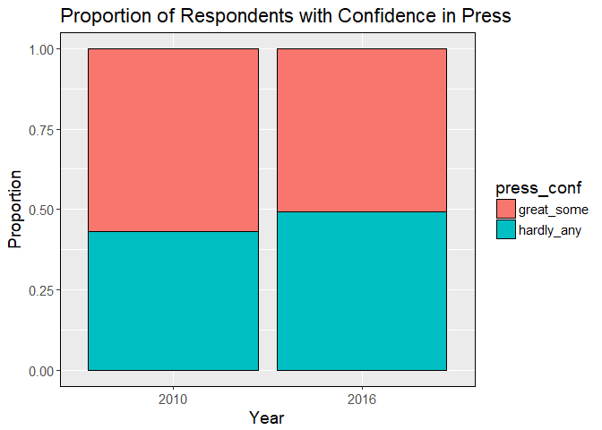

Statistical Inference with General Social Survey (GSS) Data
================

-   [Introduction](#introduction)
-   [Load packages](#load-packages)
-   [Load data](#load-data)
-   [Difference Between Two Proportions](#difference-between-two-proportions)
    -   [Research Question](#research-question)
    -   [EDA](#eda)
    -   [Inference](#inference)
        -   [Confidence Intervals](#confidence-intervals)
        -   [Hypothesis Test](#hypothesis-test)

Introduction
------------

This is a project where I will be using GSS data as a playground for statistical inference. I'll use a research question to motivate the different inference methods that I cover. This will be followed by some EDA to explore the data and gain some insight using visualizations. Finally, I will use a statistical inference technique to address the research question. Consider this a work in progress as I plan on adding examples of different statistical inference techniques as time allows.

The General Social Survey ([GSS](http://gss.norc.org/)) is a federally funded social survey that began in 1972. With a few exceptions, the survey was initially done on a yearly basis until 1994, after which it was conducted every other year. The GSS is second only to the US census as a source of data for the social sciences. Respondents are selected randomly using an area probability design and the surveys are conducted as a face-to-face interview.

Though there are some [weighting](http://gss.norc.org/documents/codebook/GSS_Codebook_AppendixA.pdf) techniques to be aware of, the data can be used for inference and establishing correlation between variables. As this is only observational data, conclusions regarding causation cannot be made. Some potential biases include potential respondents who are not home at the time the survey was to be conducted and potential respondents that refuse to participate.

Load packages
-------------

``` r
library(tidyverse)
library(statsr)
library(janitor)
```

Load data
---------

The data was obtained by creating an 'extract' from the GSS website. Essentially, the site allows one to choose features a la carte from the &gt;5000 features available and then to download the combined feature set in a file type of your choosing. Alternatively, the entire data set can be downloaded in one shot.

``` r
# load data
gss_dat <- read.csv("gss_data.csv", na.strings = c("Not applicable", " ", "Dk na"), 
    skip = 1, header = TRUE)
```

We can take a look at the first couple of rows of the data and scroll through the features.

``` r
head(gss_dat)
```

<table>
<thead>
<tr>
<th style="text-align:left;">
year
</th>
<th style="text-align:left;">
id\_
</th>
<th style="text-align:left;">
marital
</th>
<th style="text-align:left;">
spwrksta
</th>
<th style="text-align:left;">
spwrkslf
</th>
<th style="text-align:left;">
childs
</th>
<th style="text-align:left;">
age
</th>
<th style="text-align:left;">
paeduc
</th>
<th style="text-align:left;">
maeduc
</th>
<th style="text-align:left;">
speduc
</th>
<th style="text-align:left;">
degree
</th>
<th style="text-align:left;">
padeg
</th>
<th style="text-align:left;">
madeg
</th>
<th style="text-align:left;">
spdeg
</th>
<th style="text-align:left;">
sex
</th>
<th style="text-align:left;">
race
</th>
<th style="text-align:left;">
income
</th>
<th style="text-align:left;">
partyid
</th>
<th style="text-align:left;">
vote72
</th>
<th style="text-align:left;">
pres72
</th>
<th style="text-align:left;">
vote76
</th>
<th style="text-align:left;">
pres76
</th>
<th style="text-align:left;">
vote80
</th>
<th style="text-align:left;">
pres80
</th>
<th style="text-align:left;">
vote84
</th>
<th style="text-align:left;">
pres84
</th>
<th style="text-align:left;">
vote88
</th>
<th style="text-align:left;">
pres88
</th>
<th style="text-align:left;">
vote92
</th>
<th style="text-align:left;">
pres92
</th>
<th style="text-align:left;">
vote96
</th>
<th style="text-align:left;">
pres96
</th>
<th style="text-align:left;">
vote00
</th>
<th style="text-align:left;">
pres00
</th>
<th style="text-align:left;">
vote04
</th>
<th style="text-align:left;">
pres04
</th>
<th style="text-align:left;">
vote08
</th>
<th style="text-align:left;">
pres08
</th>
<th style="text-align:left;">
vote12
</th>
<th style="text-align:left;">
pres12
</th>
<th style="text-align:left;">
polviews
</th>
<th style="text-align:left;">
natspac
</th>
<th style="text-align:left;">
natenvir
</th>
<th style="text-align:left;">
natheal
</th>
<th style="text-align:left;">
natcity
</th>
<th style="text-align:left;">
natcrime
</th>
<th style="text-align:left;">
natdrug
</th>
<th style="text-align:left;">
nateduc
</th>
<th style="text-align:left;">
natrace
</th>
<th style="text-align:left;">
natarms
</th>
<th style="text-align:left;">
nataid
</th>
<th style="text-align:left;">
natfare
</th>
<th style="text-align:left;">
natroad
</th>
<th style="text-align:left;">
natsoc
</th>
<th style="text-align:left;">
natmass
</th>
<th style="text-align:left;">
natpark
</th>
<th style="text-align:left;">
natsci
</th>
<th style="text-align:left;">
eqwlth
</th>
<th style="text-align:left;">
tax
</th>
<th style="text-align:left;">
gunlaw
</th>
<th style="text-align:left;">
denom
</th>
<th style="text-align:left;">
attend
</th>
<th style="text-align:left;">
reliten
</th>
<th style="text-align:left;">
relig16
</th>
<th style="text-align:left;">
prayer
</th>
<th style="text-align:left;">
racdin
</th>
<th style="text-align:left;">
raclive
</th>
<th style="text-align:left;">
health
</th>
<th style="text-align:left;">
confinan
</th>
<th style="text-align:left;">
conbus
</th>
<th style="text-align:left;">
conclerg
</th>
<th style="text-align:left;">
coneduc
</th>
<th style="text-align:left;">
confed
</th>
<th style="text-align:left;">
conlabor
</th>
<th style="text-align:left;">
conpress
</th>
<th style="text-align:left;">
conmedic
</th>
<th style="text-align:left;">
contv
</th>
<th style="text-align:left;">
conjudge
</th>
<th style="text-align:left;">
consci
</th>
<th style="text-align:left;">
conlegis
</th>
<th style="text-align:left;">
conarmy
</th>
<th style="text-align:left;">
jobfind
</th>
<th style="text-align:left;">
unemp
</th>
<th style="text-align:left;">
abdefect
</th>
<th style="text-align:left;">
abnomore
</th>
<th style="text-align:left;">
abhlth
</th>
<th style="text-align:left;">
abpoor
</th>
<th style="text-align:left;">
abrape
</th>
<th style="text-align:left;">
absingle
</th>
<th style="text-align:left;">
abany
</th>
<th style="text-align:left;">
sexeduc
</th>
<th style="text-align:left;">
letdie1
</th>
<th style="text-align:left;">
suicide1
</th>
<th style="text-align:left;">
owngun
</th>
<th style="text-align:left;">
news
</th>
<th style="text-align:left;">
tvhours
</th>
<th style="text-align:left;">
helppoor
</th>
<th style="text-align:left;">
helpnot
</th>
<th style="text-align:left;">
helpsick
</th>
<th style="text-align:left;">
newsfrom
</th>
<th style="text-align:left;">
scifrom
</th>
<th style="text-align:left;">
advfront
</th>
<th style="text-align:left;">
vetyears
</th>
<th style="text-align:left;">
dwelown
</th>
<th style="text-align:left;">
hhrace
</th>
<th style="text-align:left;">
ballot
</th>
</tr>
</thead>
<tbody>
<tr>
<td style="text-align:left;">
1972
</td>
<td style="text-align:left;">
1
</td>
<td style="text-align:left;">
Never married
</td>
<td style="text-align:left;">
NA
</td>
<td style="text-align:left;">
NA
</td>
<td style="text-align:left;">
0
</td>
<td style="text-align:left;">
23
</td>
<td style="text-align:left;">
10
</td>
<td style="text-align:left;">
NA
</td>
<td style="text-align:left;">
NA
</td>
<td style="text-align:left;">
Bachelor
</td>
<td style="text-align:left;">
Lt high school
</td>
<td style="text-align:left;">
NA
</td>
<td style="text-align:left;">
NA
</td>
<td style="text-align:left;">
Female
</td>
<td style="text-align:left;">
White
</td>
<td style="text-align:left;">
NA
</td>
<td style="text-align:left;">
Ind,near dem
</td>
<td style="text-align:left;">
NA
</td>
<td style="text-align:left;">
NA
</td>
<td style="text-align:left;">
NA
</td>
<td style="text-align:left;">
NA
</td>
<td style="text-align:left;">
NA
</td>
<td style="text-align:left;">
NA
</td>
<td style="text-align:left;">
NA
</td>
<td style="text-align:left;">
NA
</td>
<td style="text-align:left;">
NA
</td>
<td style="text-align:left;">
NA
</td>
<td style="text-align:left;">
NA
</td>
<td style="text-align:left;">
NA
</td>
<td style="text-align:left;">
NA
</td>
<td style="text-align:left;">
NA
</td>
<td style="text-align:left;">
NA
</td>
<td style="text-align:left;">
NA
</td>
<td style="text-align:left;">
NA
</td>
<td style="text-align:left;">
NA
</td>
<td style="text-align:left;">
NA
</td>
<td style="text-align:left;">
NA
</td>
<td style="text-align:left;">
NA
</td>
<td style="text-align:left;">
NA
</td>
<td style="text-align:left;">
NA
</td>
<td style="text-align:left;">
NA
</td>
<td style="text-align:left;">
NA
</td>
<td style="text-align:left;">
NA
</td>
<td style="text-align:left;">
NA
</td>
<td style="text-align:left;">
NA
</td>
<td style="text-align:left;">
NA
</td>
<td style="text-align:left;">
NA
</td>
<td style="text-align:left;">
NA
</td>
<td style="text-align:left;">
NA
</td>
<td style="text-align:left;">
NA
</td>
<td style="text-align:left;">
NA
</td>
<td style="text-align:left;">
NA
</td>
<td style="text-align:left;">
NA
</td>
<td style="text-align:left;">
NA
</td>
<td style="text-align:left;">
NA
</td>
<td style="text-align:left;">
NA
</td>
<td style="text-align:left;">
NA
</td>
<td style="text-align:left;">
NA
</td>
<td style="text-align:left;">
Favor
</td>
<td style="text-align:left;">
NA
</td>
<td style="text-align:left;">
Once a year
</td>
<td style="text-align:left;">
NA
</td>
<td style="text-align:left;">
NA
</td>
<td style="text-align:left;">
NA
</td>
<td style="text-align:left;">
Not object
</td>
<td style="text-align:left;">
Yes
</td>
<td style="text-align:left;">
Good
</td>
<td style="text-align:left;">
NA
</td>
<td style="text-align:left;">
NA
</td>
<td style="text-align:left;">
NA
</td>
<td style="text-align:left;">
NA
</td>
<td style="text-align:left;">
NA
</td>
<td style="text-align:left;">
NA
</td>
<td style="text-align:left;">
NA
</td>
<td style="text-align:left;">
NA
</td>
<td style="text-align:left;">
NA
</td>
<td style="text-align:left;">
NA
</td>
<td style="text-align:left;">
NA
</td>
<td style="text-align:left;">
NA
</td>
<td style="text-align:left;">
NA
</td>
<td style="text-align:left;">
NA
</td>
<td style="text-align:left;">
NA
</td>
<td style="text-align:left;">
Yes
</td>
<td style="text-align:left;">
Yes
</td>
<td style="text-align:left;">
Yes
</td>
<td style="text-align:left;">
Yes
</td>
<td style="text-align:left;">
Yes
</td>
<td style="text-align:left;">
Yes
</td>
<td style="text-align:left;">
NA
</td>
<td style="text-align:left;">
NA
</td>
<td style="text-align:left;">
NA
</td>
<td style="text-align:left;">
NA
</td>
<td style="text-align:left;">
NA
</td>
<td style="text-align:left;">
Everyday
</td>
<td style="text-align:left;">
NA
</td>
<td style="text-align:left;">
NA
</td>
<td style="text-align:left;">
NA
</td>
<td style="text-align:left;">
NA
</td>
<td style="text-align:left;">
NA
</td>
<td style="text-align:left;">
NA
</td>
<td style="text-align:left;">
NA
</td>
<td style="text-align:left;">
NA
</td>
<td style="text-align:left;">
NA
</td>
<td style="text-align:left;">
NA
</td>
<td style="text-align:left;">
NA
</td>
</tr>
<tr>
<td style="text-align:left;">
1972
</td>
<td style="text-align:left;">
2
</td>
<td style="text-align:left;">
Married
</td>
<td style="text-align:left;">
Keeping house
</td>
<td style="text-align:left;">
NA
</td>
<td style="text-align:left;">
5
</td>
<td style="text-align:left;">
70
</td>
<td style="text-align:left;">
8
</td>
<td style="text-align:left;">
8
</td>
<td style="text-align:left;">
12
</td>
<td style="text-align:left;">
Lt high school
</td>
<td style="text-align:left;">
Lt high school
</td>
<td style="text-align:left;">
Lt high school
</td>
<td style="text-align:left;">
High school
</td>
<td style="text-align:left;">
Male
</td>
<td style="text-align:left;">
White
</td>
<td style="text-align:left;">
NA
</td>
<td style="text-align:left;">
Not str democrat
</td>
<td style="text-align:left;">
NA
</td>
<td style="text-align:left;">
NA
</td>
<td style="text-align:left;">
NA
</td>
<td style="text-align:left;">
NA
</td>
<td style="text-align:left;">
NA
</td>
<td style="text-align:left;">
NA
</td>
<td style="text-align:left;">
NA
</td>
<td style="text-align:left;">
NA
</td>
<td style="text-align:left;">
NA
</td>
<td style="text-align:left;">
NA
</td>
<td style="text-align:left;">
NA
</td>
<td style="text-align:left;">
NA
</td>
<td style="text-align:left;">
NA
</td>
<td style="text-align:left;">
NA
</td>
<td style="text-align:left;">
NA
</td>
<td style="text-align:left;">
NA
</td>
<td style="text-align:left;">
NA
</td>
<td style="text-align:left;">
NA
</td>
<td style="text-align:left;">
NA
</td>
<td style="text-align:left;">
NA
</td>
<td style="text-align:left;">
NA
</td>
<td style="text-align:left;">
NA
</td>
<td style="text-align:left;">
NA
</td>
<td style="text-align:left;">
NA
</td>
<td style="text-align:left;">
NA
</td>
<td style="text-align:left;">
NA
</td>
<td style="text-align:left;">
NA
</td>
<td style="text-align:left;">
NA
</td>
<td style="text-align:left;">
NA
</td>
<td style="text-align:left;">
NA
</td>
<td style="text-align:left;">
NA
</td>
<td style="text-align:left;">
NA
</td>
<td style="text-align:left;">
NA
</td>
<td style="text-align:left;">
NA
</td>
<td style="text-align:left;">
NA
</td>
<td style="text-align:left;">
NA
</td>
<td style="text-align:left;">
NA
</td>
<td style="text-align:left;">
NA
</td>
<td style="text-align:left;">
NA
</td>
<td style="text-align:left;">
NA
</td>
<td style="text-align:left;">
NA
</td>
<td style="text-align:left;">
Favor
</td>
<td style="text-align:left;">
NA
</td>
<td style="text-align:left;">
Every week
</td>
<td style="text-align:left;">
NA
</td>
<td style="text-align:left;">
NA
</td>
<td style="text-align:left;">
NA
</td>
<td style="text-align:left;">
Not object
</td>
<td style="text-align:left;">
Yes
</td>
<td style="text-align:left;">
Fair
</td>
<td style="text-align:left;">
NA
</td>
<td style="text-align:left;">
NA
</td>
<td style="text-align:left;">
NA
</td>
<td style="text-align:left;">
NA
</td>
<td style="text-align:left;">
NA
</td>
<td style="text-align:left;">
NA
</td>
<td style="text-align:left;">
NA
</td>
<td style="text-align:left;">
NA
</td>
<td style="text-align:left;">
NA
</td>
<td style="text-align:left;">
NA
</td>
<td style="text-align:left;">
NA
</td>
<td style="text-align:left;">
NA
</td>
<td style="text-align:left;">
NA
</td>
<td style="text-align:left;">
NA
</td>
<td style="text-align:left;">
NA
</td>
<td style="text-align:left;">
Yes
</td>
<td style="text-align:left;">
No
</td>
<td style="text-align:left;">
Yes
</td>
<td style="text-align:left;">
No
</td>
<td style="text-align:left;">
Yes
</td>
<td style="text-align:left;">
Yes
</td>
<td style="text-align:left;">
NA
</td>
<td style="text-align:left;">
NA
</td>
<td style="text-align:left;">
NA
</td>
<td style="text-align:left;">
NA
</td>
<td style="text-align:left;">
NA
</td>
<td style="text-align:left;">
Everyday
</td>
<td style="text-align:left;">
NA
</td>
<td style="text-align:left;">
NA
</td>
<td style="text-align:left;">
NA
</td>
<td style="text-align:left;">
NA
</td>
<td style="text-align:left;">
NA
</td>
<td style="text-align:left;">
NA
</td>
<td style="text-align:left;">
NA
</td>
<td style="text-align:left;">
NA
</td>
<td style="text-align:left;">
NA
</td>
<td style="text-align:left;">
NA
</td>
<td style="text-align:left;">
NA
</td>
</tr>
<tr>
<td style="text-align:left;">
1972
</td>
<td style="text-align:left;">
3
</td>
<td style="text-align:left;">
Married
</td>
<td style="text-align:left;">
Working fulltime
</td>
<td style="text-align:left;">
Someone else
</td>
<td style="text-align:left;">
4
</td>
<td style="text-align:left;">
48
</td>
<td style="text-align:left;">
8
</td>
<td style="text-align:left;">
8
</td>
<td style="text-align:left;">
11
</td>
<td style="text-align:left;">
High school
</td>
<td style="text-align:left;">
Lt high school
</td>
<td style="text-align:left;">
Lt high school
</td>
<td style="text-align:left;">
No answer
</td>
<td style="text-align:left;">
Female
</td>
<td style="text-align:left;">
White
</td>
<td style="text-align:left;">
NA
</td>
<td style="text-align:left;">
Independent
</td>
<td style="text-align:left;">
NA
</td>
<td style="text-align:left;">
NA
</td>
<td style="text-align:left;">
NA
</td>
<td style="text-align:left;">
NA
</td>
<td style="text-align:left;">
NA
</td>
<td style="text-align:left;">
NA
</td>
<td style="text-align:left;">
NA
</td>
<td style="text-align:left;">
NA
</td>
<td style="text-align:left;">
NA
</td>
<td style="text-align:left;">
NA
</td>
<td style="text-align:left;">
NA
</td>
<td style="text-align:left;">
NA
</td>
<td style="text-align:left;">
NA
</td>
<td style="text-align:left;">
NA
</td>
<td style="text-align:left;">
NA
</td>
<td style="text-align:left;">
NA
</td>
<td style="text-align:left;">
NA
</td>
<td style="text-align:left;">
NA
</td>
<td style="text-align:left;">
NA
</td>
<td style="text-align:left;">
NA
</td>
<td style="text-align:left;">
NA
</td>
<td style="text-align:left;">
NA
</td>
<td style="text-align:left;">
NA
</td>
<td style="text-align:left;">
NA
</td>
<td style="text-align:left;">
NA
</td>
<td style="text-align:left;">
NA
</td>
<td style="text-align:left;">
NA
</td>
<td style="text-align:left;">
NA
</td>
<td style="text-align:left;">
NA
</td>
<td style="text-align:left;">
NA
</td>
<td style="text-align:left;">
NA
</td>
<td style="text-align:left;">
NA
</td>
<td style="text-align:left;">
NA
</td>
<td style="text-align:left;">
NA
</td>
<td style="text-align:left;">
NA
</td>
<td style="text-align:left;">
NA
</td>
<td style="text-align:left;">
NA
</td>
<td style="text-align:left;">
NA
</td>
<td style="text-align:left;">
NA
</td>
<td style="text-align:left;">
NA
</td>
<td style="text-align:left;">
NA
</td>
<td style="text-align:left;">
Favor
</td>
<td style="text-align:left;">
Methodist-dk which
</td>
<td style="text-align:left;">
Once a month
</td>
<td style="text-align:left;">
NA
</td>
<td style="text-align:left;">
NA
</td>
<td style="text-align:left;">
NA
</td>
<td style="text-align:left;">
Not object
</td>
<td style="text-align:left;">
Yes
</td>
<td style="text-align:left;">
Excellent
</td>
<td style="text-align:left;">
NA
</td>
<td style="text-align:left;">
NA
</td>
<td style="text-align:left;">
NA
</td>
<td style="text-align:left;">
NA
</td>
<td style="text-align:left;">
NA
</td>
<td style="text-align:left;">
NA
</td>
<td style="text-align:left;">
NA
</td>
<td style="text-align:left;">
NA
</td>
<td style="text-align:left;">
NA
</td>
<td style="text-align:left;">
NA
</td>
<td style="text-align:left;">
NA
</td>
<td style="text-align:left;">
NA
</td>
<td style="text-align:left;">
NA
</td>
<td style="text-align:left;">
NA
</td>
<td style="text-align:left;">
NA
</td>
<td style="text-align:left;">
Yes
</td>
<td style="text-align:left;">
Yes
</td>
<td style="text-align:left;">
Yes
</td>
<td style="text-align:left;">
Yes
</td>
<td style="text-align:left;">
Yes
</td>
<td style="text-align:left;">
Yes
</td>
<td style="text-align:left;">
NA
</td>
<td style="text-align:left;">
NA
</td>
<td style="text-align:left;">
NA
</td>
<td style="text-align:left;">
NA
</td>
<td style="text-align:left;">
NA
</td>
<td style="text-align:left;">
Everyday
</td>
<td style="text-align:left;">
NA
</td>
<td style="text-align:left;">
NA
</td>
<td style="text-align:left;">
NA
</td>
<td style="text-align:left;">
NA
</td>
<td style="text-align:left;">
NA
</td>
<td style="text-align:left;">
NA
</td>
<td style="text-align:left;">
NA
</td>
<td style="text-align:left;">
NA
</td>
<td style="text-align:left;">
NA
</td>
<td style="text-align:left;">
NA
</td>
<td style="text-align:left;">
NA
</td>
</tr>
<tr>
<td style="text-align:left;">
1972
</td>
<td style="text-align:left;">
4
</td>
<td style="text-align:left;">
Married
</td>
<td style="text-align:left;">
Working fulltime
</td>
<td style="text-align:left;">
Someone else
</td>
<td style="text-align:left;">
0
</td>
<td style="text-align:left;">
27
</td>
<td style="text-align:left;">
16
</td>
<td style="text-align:left;">
12
</td>
<td style="text-align:left;">
20
</td>
<td style="text-align:left;">
Bachelor
</td>
<td style="text-align:left;">
Bachelor
</td>
<td style="text-align:left;">
High school
</td>
<td style="text-align:left;">
Graduate
</td>
<td style="text-align:left;">
Female
</td>
<td style="text-align:left;">
White
</td>
<td style="text-align:left;">
NA
</td>
<td style="text-align:left;">
Not str democrat
</td>
<td style="text-align:left;">
NA
</td>
<td style="text-align:left;">
NA
</td>
<td style="text-align:left;">
NA
</td>
<td style="text-align:left;">
NA
</td>
<td style="text-align:left;">
NA
</td>
<td style="text-align:left;">
NA
</td>
<td style="text-align:left;">
NA
</td>
<td style="text-align:left;">
NA
</td>
<td style="text-align:left;">
NA
</td>
<td style="text-align:left;">
NA
</td>
<td style="text-align:left;">
NA
</td>
<td style="text-align:left;">
NA
</td>
<td style="text-align:left;">
NA
</td>
<td style="text-align:left;">
NA
</td>
<td style="text-align:left;">
NA
</td>
<td style="text-align:left;">
NA
</td>
<td style="text-align:left;">
NA
</td>
<td style="text-align:left;">
NA
</td>
<td style="text-align:left;">
NA
</td>
<td style="text-align:left;">
NA
</td>
<td style="text-align:left;">
NA
</td>
<td style="text-align:left;">
NA
</td>
<td style="text-align:left;">
NA
</td>
<td style="text-align:left;">
NA
</td>
<td style="text-align:left;">
NA
</td>
<td style="text-align:left;">
NA
</td>
<td style="text-align:left;">
NA
</td>
<td style="text-align:left;">
NA
</td>
<td style="text-align:left;">
NA
</td>
<td style="text-align:left;">
NA
</td>
<td style="text-align:left;">
NA
</td>
<td style="text-align:left;">
NA
</td>
<td style="text-align:left;">
NA
</td>
<td style="text-align:left;">
NA
</td>
<td style="text-align:left;">
NA
</td>
<td style="text-align:left;">
NA
</td>
<td style="text-align:left;">
NA
</td>
<td style="text-align:left;">
NA
</td>
<td style="text-align:left;">
NA
</td>
<td style="text-align:left;">
NA
</td>
<td style="text-align:left;">
NA
</td>
<td style="text-align:left;">
Favor
</td>
<td style="text-align:left;">
NA
</td>
<td style="text-align:left;">
Never
</td>
<td style="text-align:left;">
NA
</td>
<td style="text-align:left;">
NA
</td>
<td style="text-align:left;">
NA
</td>
<td style="text-align:left;">
Not object
</td>
<td style="text-align:left;">
Yes
</td>
<td style="text-align:left;">
Good
</td>
<td style="text-align:left;">
NA
</td>
<td style="text-align:left;">
NA
</td>
<td style="text-align:left;">
NA
</td>
<td style="text-align:left;">
NA
</td>
<td style="text-align:left;">
NA
</td>
<td style="text-align:left;">
NA
</td>
<td style="text-align:left;">
NA
</td>
<td style="text-align:left;">
NA
</td>
<td style="text-align:left;">
NA
</td>
<td style="text-align:left;">
NA
</td>
<td style="text-align:left;">
NA
</td>
<td style="text-align:left;">
NA
</td>
<td style="text-align:left;">
NA
</td>
<td style="text-align:left;">
NA
</td>
<td style="text-align:left;">
NA
</td>
<td style="text-align:left;">
No
</td>
<td style="text-align:left;">
No
</td>
<td style="text-align:left;">
Yes
</td>
<td style="text-align:left;">
Yes
</td>
<td style="text-align:left;">
Yes
</td>
<td style="text-align:left;">
Yes
</td>
<td style="text-align:left;">
NA
</td>
<td style="text-align:left;">
NA
</td>
<td style="text-align:left;">
NA
</td>
<td style="text-align:left;">
NA
</td>
<td style="text-align:left;">
NA
</td>
<td style="text-align:left;">
Once a week
</td>
<td style="text-align:left;">
NA
</td>
<td style="text-align:left;">
NA
</td>
<td style="text-align:left;">
NA
</td>
<td style="text-align:left;">
NA
</td>
<td style="text-align:left;">
NA
</td>
<td style="text-align:left;">
NA
</td>
<td style="text-align:left;">
NA
</td>
<td style="text-align:left;">
NA
</td>
<td style="text-align:left;">
NA
</td>
<td style="text-align:left;">
NA
</td>
<td style="text-align:left;">
NA
</td>
</tr>
<tr>
<td style="text-align:left;">
1972
</td>
<td style="text-align:left;">
5
</td>
<td style="text-align:left;">
Married
</td>
<td style="text-align:left;">
Temp not working
</td>
<td style="text-align:left;">
Someone else
</td>
<td style="text-align:left;">
2
</td>
<td style="text-align:left;">
61
</td>
<td style="text-align:left;">
8
</td>
<td style="text-align:left;">
8
</td>
<td style="text-align:left;">
12
</td>
<td style="text-align:left;">
High school
</td>
<td style="text-align:left;">
Lt high school
</td>
<td style="text-align:left;">
Lt high school
</td>
<td style="text-align:left;">
High school
</td>
<td style="text-align:left;">
Female
</td>
<td style="text-align:left;">
White
</td>
<td style="text-align:left;">
NA
</td>
<td style="text-align:left;">
Strong democrat
</td>
<td style="text-align:left;">
NA
</td>
<td style="text-align:left;">
NA
</td>
<td style="text-align:left;">
NA
</td>
<td style="text-align:left;">
NA
</td>
<td style="text-align:left;">
NA
</td>
<td style="text-align:left;">
NA
</td>
<td style="text-align:left;">
NA
</td>
<td style="text-align:left;">
NA
</td>
<td style="text-align:left;">
NA
</td>
<td style="text-align:left;">
NA
</td>
<td style="text-align:left;">
NA
</td>
<td style="text-align:left;">
NA
</td>
<td style="text-align:left;">
NA
</td>
<td style="text-align:left;">
NA
</td>
<td style="text-align:left;">
NA
</td>
<td style="text-align:left;">
NA
</td>
<td style="text-align:left;">
NA
</td>
<td style="text-align:left;">
NA
</td>
<td style="text-align:left;">
NA
</td>
<td style="text-align:left;">
NA
</td>
<td style="text-align:left;">
NA
</td>
<td style="text-align:left;">
NA
</td>
<td style="text-align:left;">
NA
</td>
<td style="text-align:left;">
NA
</td>
<td style="text-align:left;">
NA
</td>
<td style="text-align:left;">
NA
</td>
<td style="text-align:left;">
NA
</td>
<td style="text-align:left;">
NA
</td>
<td style="text-align:left;">
NA
</td>
<td style="text-align:left;">
NA
</td>
<td style="text-align:left;">
NA
</td>
<td style="text-align:left;">
NA
</td>
<td style="text-align:left;">
NA
</td>
<td style="text-align:left;">
NA
</td>
<td style="text-align:left;">
NA
</td>
<td style="text-align:left;">
NA
</td>
<td style="text-align:left;">
NA
</td>
<td style="text-align:left;">
NA
</td>
<td style="text-align:left;">
NA
</td>
<td style="text-align:left;">
NA
</td>
<td style="text-align:left;">
NA
</td>
<td style="text-align:left;">
Favor
</td>
<td style="text-align:left;">
Methodist-dk which
</td>
<td style="text-align:left;">
Never
</td>
<td style="text-align:left;">
NA
</td>
<td style="text-align:left;">
NA
</td>
<td style="text-align:left;">
NA
</td>
<td style="text-align:left;">
Not object
</td>
<td style="text-align:left;">
Yes
</td>
<td style="text-align:left;">
Good
</td>
<td style="text-align:left;">
NA
</td>
<td style="text-align:left;">
NA
</td>
<td style="text-align:left;">
NA
</td>
<td style="text-align:left;">
NA
</td>
<td style="text-align:left;">
NA
</td>
<td style="text-align:left;">
NA
</td>
<td style="text-align:left;">
NA
</td>
<td style="text-align:left;">
NA
</td>
<td style="text-align:left;">
NA
</td>
<td style="text-align:left;">
NA
</td>
<td style="text-align:left;">
NA
</td>
<td style="text-align:left;">
NA
</td>
<td style="text-align:left;">
NA
</td>
<td style="text-align:left;">
NA
</td>
<td style="text-align:left;">
NA
</td>
<td style="text-align:left;">
Yes
</td>
<td style="text-align:left;">
Yes
</td>
<td style="text-align:left;">
Yes
</td>
<td style="text-align:left;">
Yes
</td>
<td style="text-align:left;">
Yes
</td>
<td style="text-align:left;">
Yes
</td>
<td style="text-align:left;">
NA
</td>
<td style="text-align:left;">
NA
</td>
<td style="text-align:left;">
NA
</td>
<td style="text-align:left;">
NA
</td>
<td style="text-align:left;">
NA
</td>
<td style="text-align:left;">
Everyday
</td>
<td style="text-align:left;">
NA
</td>
<td style="text-align:left;">
NA
</td>
<td style="text-align:left;">
NA
</td>
<td style="text-align:left;">
NA
</td>
<td style="text-align:left;">
NA
</td>
<td style="text-align:left;">
NA
</td>
<td style="text-align:left;">
NA
</td>
<td style="text-align:left;">
NA
</td>
<td style="text-align:left;">
NA
</td>
<td style="text-align:left;">
NA
</td>
<td style="text-align:left;">
NA
</td>
</tr>
<tr>
<td style="text-align:left;">
1972
</td>
<td style="text-align:left;">
6
</td>
<td style="text-align:left;">
Never married
</td>
<td style="text-align:left;">
NA
</td>
<td style="text-align:left;">
NA
</td>
<td style="text-align:left;">
0
</td>
<td style="text-align:left;">
26
</td>
<td style="text-align:left;">
18
</td>
<td style="text-align:left;">
19
</td>
<td style="text-align:left;">
NA
</td>
<td style="text-align:left;">
High school
</td>
<td style="text-align:left;">
Bachelor
</td>
<td style="text-align:left;">
Graduate
</td>
<td style="text-align:left;">
NA
</td>
<td style="text-align:left;">
Male
</td>
<td style="text-align:left;">
White
</td>
<td style="text-align:left;">
NA
</td>
<td style="text-align:left;">
Ind,near dem
</td>
<td style="text-align:left;">
NA
</td>
<td style="text-align:left;">
NA
</td>
<td style="text-align:left;">
NA
</td>
<td style="text-align:left;">
NA
</td>
<td style="text-align:left;">
NA
</td>
<td style="text-align:left;">
NA
</td>
<td style="text-align:left;">
NA
</td>
<td style="text-align:left;">
NA
</td>
<td style="text-align:left;">
NA
</td>
<td style="text-align:left;">
NA
</td>
<td style="text-align:left;">
NA
</td>
<td style="text-align:left;">
NA
</td>
<td style="text-align:left;">
NA
</td>
<td style="text-align:left;">
NA
</td>
<td style="text-align:left;">
NA
</td>
<td style="text-align:left;">
NA
</td>
<td style="text-align:left;">
NA
</td>
<td style="text-align:left;">
NA
</td>
<td style="text-align:left;">
NA
</td>
<td style="text-align:left;">
NA
</td>
<td style="text-align:left;">
NA
</td>
<td style="text-align:left;">
NA
</td>
<td style="text-align:left;">
NA
</td>
<td style="text-align:left;">
NA
</td>
<td style="text-align:left;">
NA
</td>
<td style="text-align:left;">
NA
</td>
<td style="text-align:left;">
NA
</td>
<td style="text-align:left;">
NA
</td>
<td style="text-align:left;">
NA
</td>
<td style="text-align:left;">
NA
</td>
<td style="text-align:left;">
NA
</td>
<td style="text-align:left;">
NA
</td>
<td style="text-align:left;">
NA
</td>
<td style="text-align:left;">
NA
</td>
<td style="text-align:left;">
NA
</td>
<td style="text-align:left;">
NA
</td>
<td style="text-align:left;">
NA
</td>
<td style="text-align:left;">
NA
</td>
<td style="text-align:left;">
NA
</td>
<td style="text-align:left;">
NA
</td>
<td style="text-align:left;">
NA
</td>
<td style="text-align:left;">
Oppose
</td>
<td style="text-align:left;">
Episcopal
</td>
<td style="text-align:left;">
Once a year
</td>
<td style="text-align:left;">
NA
</td>
<td style="text-align:left;">
NA
</td>
<td style="text-align:left;">
NA
</td>
<td style="text-align:left;">
Mildly object
</td>
<td style="text-align:left;">
Yes
</td>
<td style="text-align:left;">
Good
</td>
<td style="text-align:left;">
NA
</td>
<td style="text-align:left;">
NA
</td>
<td style="text-align:left;">
NA
</td>
<td style="text-align:left;">
NA
</td>
<td style="text-align:left;">
NA
</td>
<td style="text-align:left;">
NA
</td>
<td style="text-align:left;">
NA
</td>
<td style="text-align:left;">
NA
</td>
<td style="text-align:left;">
NA
</td>
<td style="text-align:left;">
NA
</td>
<td style="text-align:left;">
NA
</td>
<td style="text-align:left;">
NA
</td>
<td style="text-align:left;">
NA
</td>
<td style="text-align:left;">
NA
</td>
<td style="text-align:left;">
NA
</td>
<td style="text-align:left;">
Yes
</td>
<td style="text-align:left;">
Yes
</td>
<td style="text-align:left;">
Yes
</td>
<td style="text-align:left;">
Yes
</td>
<td style="text-align:left;">
Yes
</td>
<td style="text-align:left;">
Yes
</td>
<td style="text-align:left;">
NA
</td>
<td style="text-align:left;">
NA
</td>
<td style="text-align:left;">
NA
</td>
<td style="text-align:left;">
NA
</td>
<td style="text-align:left;">
NA
</td>
<td style="text-align:left;">
Everyday
</td>
<td style="text-align:left;">
NA
</td>
<td style="text-align:left;">
NA
</td>
<td style="text-align:left;">
NA
</td>
<td style="text-align:left;">
NA
</td>
<td style="text-align:left;">
NA
</td>
<td style="text-align:left;">
NA
</td>
<td style="text-align:left;">
NA
</td>
<td style="text-align:left;">
NA
</td>
<td style="text-align:left;">
NA
</td>
<td style="text-align:left;">
NA
</td>
<td style="text-align:left;">
NA
</td>
</tr>
</tbody>
</table>

Difference Between Two Proportions
----------------------------------

### Research Question

*Is the proportion of people who have 'Hardly Any' confidence in the press different in 2016 than it was in 2010?*

In this time of post-truth politics, the free press in America is as important as ever. Yet some try to demonize the press by calling them 'the enemy of the people' or that their reporting is 'fake news'. While this data set only contains data up to 2016, this analysis will set the ground work for 2018 when it becomes available.

### EDA

We'll first subset our data for the years 2010 and 2016 and then create a feature related to people's confidence in the press. This is done by using the original feature and distributing the responses into two categories- 'hardly\_any' and 'great\_some'. The 'great\_some' level combines the 'Great' and 'Some' levels of the original factor.

``` r
# filter for years of interest and create press_conf feature
gss_press <- gss_dat %>% filter(year == 2010 | year == 2016) %>% mutate(press_conf = ifelse(conpress == 
    "Hardly any", "hardly_any", "great_some")) %>% droplevels() %>% select(year, 
    press_conf) %>% na.omit
```

We'll then create a table to compare the total counts across years and the factor levels for the press\_conf feature.

``` r
# create table of counts for press_conf by years
tabyl(gss_press, year, press_conf) %>% adorn_totals(c("row", "col"))
```

<table>
<thead>
<tr>
<th style="text-align:left;">
year
</th>
<th style="text-align:right;">
great\_some
</th>
<th style="text-align:right;">
hardly\_any
</th>
<th style="text-align:right;">
Total
</th>
</tr>
</thead>
<tbody>
<tr>
<td style="text-align:left;">
2010
</td>
<td style="text-align:right;">
783
</td>
<td style="text-align:right;">
594
</td>
<td style="text-align:right;">
1377
</td>
</tr>
<tr>
<td style="text-align:left;">
2016
</td>
<td style="text-align:right;">
993
</td>
<td style="text-align:right;">
963
</td>
<td style="text-align:right;">
1956
</td>
</tr>
<tr>
<td style="text-align:left;">
Total
</td>
<td style="text-align:right;">
1776
</td>
<td style="text-align:right;">
1557
</td>
<td style="text-align:right;">
3333
</td>
</tr>
</tbody>
</table>

From the table, we can calculate the proportion of respondents who had 'hardly\_any' confidence in the press in 2010 and 2016.
$$\\small \\hat{p}\_{2010} = 594/1377 = 0.43$$
$$\\small \\hat{p}\_{2016} = 963/1956 = 0.49$$

It appears that the proportion of respondents in our sample data who had 'hardly\_any' confidence in the press increased in 2016 relative to 2010. We can visualize the difference in proportions with a bar plot.

``` r
ggplot(gss_press, aes(x = year, fill = press_conf)) + theme(panel.border = element_rect(colour = "black", 
    fill = NA)) + theme(text = element_text(size = 14)) + labs(x = "Year", y = "Proportion") + 
    ggtitle("Proportion of Respondents with Confidence in Press") + geom_bar(position = "fill", 
    color = "black")
```



### Inference

While there was clearly a difference in proportions in our sample data, we are interested in the difference in proportions of the population. We'll use confidence intervals (CI) and hypothesis testing to make inferences about the population at large.

#### Confidence Intervals

Before we rely on the normal model to calculate the confidence interval for the difference in proportions, we need to ensure that certain conditions are met.
To satisfy the independence requirement, the data should be a random sample, n should be &lt;10% of the population, and the two samples should be independent. The sample size/skew condition is met when there are at least 10 instances of successes *and* failures. Success is defined as 'hardly\_any' in this analysis.

<table>
<thead>
<tr>
<th style="text-align:left;">
year
</th>
<th style="text-align:right;">
great\_some
</th>
<th style="text-align:right;">
hardly\_any
</th>
<th style="text-align:right;">
Total
</th>
</tr>
</thead>
<tbody>
<tr>
<td style="text-align:left;">
2010
</td>
<td style="text-align:right;">
783
</td>
<td style="text-align:right;">
594
</td>
<td style="text-align:right;">
1377
</td>
</tr>
<tr>
<td style="text-align:left;">
2016
</td>
<td style="text-align:right;">
993
</td>
<td style="text-align:right;">
963
</td>
<td style="text-align:right;">
1956
</td>
</tr>
<tr>
<td style="text-align:left;">
Total
</td>
<td style="text-align:right;">
1776
</td>
<td style="text-align:right;">
1557
</td>
<td style="text-align:right;">
3333
</td>
</tr>
</tbody>
</table>

**Conditions for using the normal model:**
1. **Independence**:
✓ random sample: yes for 2010 and 2016
✓ 10% condition for 2010 and 2016
✓ samples for 2010 and 2016 not paired
2. **Size/skew**:
✓ 2010: 594 successes, 1377-594 = 783 failures
✓ 2016: 963 successes, 1956-963 = 993 failures.

Having satisfied the above conditions, we can continue with our analysis and assume that the sampling distribution of the difference between the proportions follows a normal distribution.

We'll use a 95% confidence level to create the confidence interval for the difference in our two proportions. Our point estimate is simply the difference in the sample proportions.
$$\\small \\hat{p}\_{2016} - \\hat{p}\_{2010} = 0.492 - 0.431 = 0.061$$
 The standard error can be calculated using the equation below.
$$\\small SE \\approx \\sqrt{\\frac{0.49(1-0.49)}{1956} + \\frac{0.43(1-0.43)}{1377}} = 0.017$$
 The CI at the 95% confidence level is then calculated using our point estimate, SE, and the critical value for the 95% confidence level (1.96).

$$\\small point\\ estimate \\pm z\*SE \\rightarrow 0.06 \\pm 1.96 \*0.017 \\rightarrow (0.027,0.093) $$
 It can be useful to walk through the above calculations, however, there are packages that will provide the result in one chunk of code. Using the inference() function of the statsr package we see that, aside from some rounding error, our calculated result is in aggreement with the inference() function output.

``` r
# calculation of confidence interval with inference function
inference(y = press_conf, x = year, order = c(2016, 2010), data = gss_press, 
    conf_level = 0.95, statistic = "proportion", type = "ci", method = "theoretical", 
    success = "hardly_any", show_eda_plot = FALSE)
```

    ## Response variable: categorical (2 levels, success: hardly_any)
    ## Explanatory variable: categorical (2 levels) 
    ## n_2016 = 1956, p_hat_2016 = 0.4923
    ## n_2010 = 1377, p_hat_2010 = 0.4314
    ## 95% CI (2016 - 2010): (0.0267 , 0.0952)

##### Confidence Interval- Conclusion

Based on this confidence interval, we can be 95% confident that the difference in the proportion of people in 2010 and 2016 who had 'hardly\_any' confidence in the press is between 2.7% and 9.5%. Based on the data, there is strong evidence that the proportion increased in 2016.

#### Hypothesis Test

As we did with the confidence interval analysis, we need to meet certain conditions in order to use the normal model for the hypothesis test. The independence requirements are the same and we've already demonstrated that those conditions have been met. There is a slight difference in how the success/failure counts are calculated for a hypothesis test when the null hypothesis states that the two proportions are equal. In this case, we use the pooled proportion to calculate success/failure counts for both samples. As we'll see, the pooled proportion is also used for calculating the standard error.
The pooled proportion is calculated by adding up all 'successes' and dividing by the total number of samples.

$$\\small \\hat{p}\_{pooled}= \\frac{594 + 963}{1377 +1956} = 0.47 $$
 Next we'll demonstrate the calculation of success and failure counts using the pooled proportion for the year 2000.
$$\\small \\hat{p}\_{pooled}n\_{2010} = 0.47(1377)=647\\ successes$$

$$\\small {(1-\\hat{p}\_{pooled})}n\_{2010}=0.53(1377)=729\\ failures$$
 We see that we've met the success/failure conditions for the year 2010. We'd find the same to be true for the sample data for 2016. Having satisfied the conditions, we can move ahead with our hypothesis test.

The first thing we need to do is to establish our null and alternative hypotheses. Our null hypothesis is that there is no difference in the proportions while the alternative hypothesis states that there is a difference in the proportions. The alternative hypothesis doesn't stipulate whether the proportion increased or decreased in 2016 so we'll be conducting a two-tailed test.

$$\\small H\_0:  p\_{2010} =  p\_{2016}$$
$$\\small H\_A:  p\_{2010} \\neq p\_{2016}$$
 We use the equation below to calculate the test statistic for our hypothesis test.
$$\\small Z= \\frac{point\\ estimate-null\\ value}{SE} $$
 As alluded to earlier, the calculation of the standard error for a hypothesis test is slightly different in that the pooled proportion is used.

The standard error then becomes:

$$ \\small SE \\approx \\sqrt{\\frac{0.47(1-0.47)}{1956} + \\frac{0.47(1-0.47)}{1377}} = 0.0176$$
 Finally our test statistic is calculated below.
$$\\small Z = \\frac{0.061-0}{0.0176}=3.47 $$
 We can now calculate the p-value from our Z-score.

``` r
# calculation of p-value for two-tailed test
2 * pnorm(3.47, lower.tail = FALSE)
```

    ## [1] 0.0005204584

##### Hypothesis Test- Conclusion

With p&lt;0.05, we can reject the null hypothesis and state that we are 95% confident that there is a difference in the proportion of people in 2010 and 2016 that had 'hardly\_any' confidence in the press. Based on the data, there is strong evidence that the proportion increased in 2016. The confidence interval result and the hypothesis test are in agreement in that the 95% confidence interval did not contain 0 and the hypothesis test rejected the null hypothesis which stated that the differnce in proportions was 0.

Finally, rather than going through the above calculations, we can run a hypothesis test in one chunk of code with the inference() function. The output also provides a visualization of the shaded regions of the normal curve corresponding to the p-value for our hypothesis test.

``` r
# hypothesis test with inference function
inference(y = press_conf, x = year, order = c(2016, 2010), data = gss_press, 
    statistic = "proportion", type = "ht", method = "theoretical", success = "hardly_any", 
    null = 0, alternative = "twosided")
```

    ## Response variable: categorical (2 levels, success: hardly_any)
    ## Explanatory variable: categorical (2 levels) 
    ## n_2016 = 1956, p_hat_2016 = 0.4923
    ## n_2010 = 1377, p_hat_2010 = 0.4314
    ## H0: p_2016 =  p_2010
    ## HA: p_2016 != p_2010
    ## z = 3.4733
    ## p_value = 5e-04


